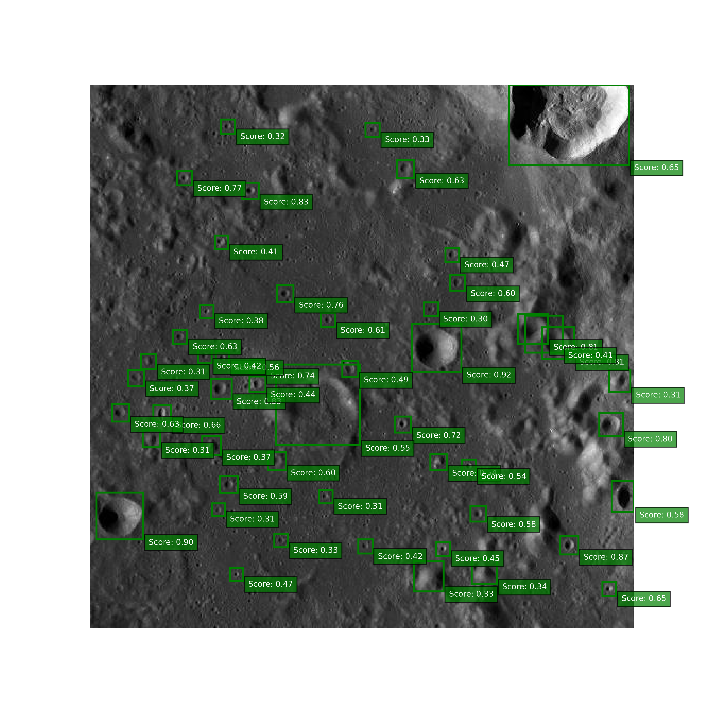

# 🚀 FederNet: a robust convnet-based terrain relative navigation system for planetary applications
## Towards autonomous navigation 🛰️ of spacecrafts in lunar terrains 🌌🪐🌕
### (University of Study of Naples Federico II)

<p align="center">
 
</p>

The VBN system–that has been called “FederNet”– that combines the strength of a convolutional neural network (CNN or convnet) with the robustness of projective invariants theory. FederNet is specifically designed for a lunar mission but its applicability could be furthed extended to other airless bodies.

The core algorithm stands in the crater detection algortihm (CDA), performed with a robust deep-learning technique. 


# 📖 Getting Started:
## 1. 📦 Installation:

This script checks if Python is installed and then runs the setup.py file with the develop command, installing the specified dependencies and setting up the mmdetection project.

Install the software and the download the required weights file with:
```
source  runscripts/install.sh
```

## 2. 🏃🏻 Run the crater detection algorithm (CDA):
This code snippet is an example command to run the inference.py script located in the CDA directory. The script takes in an image path, a threshold value, and a device (either 'cpu' or 'cuda') as command line arguments.

The <span style="color:green;font-weight:bold">--img_path</span> argument specifies the path to the input image that the script will perform inference on. The <span style="color:green;font-weight:bold">--threshold</span> argument specifies the minimum confidence score required for a detection to be considered valid. The <span style="color:green;font-weight:bold">--device</span> argument specifies whether to use the CPU or GPU for inference.

**NB**: To run this command, you would need to replace path_to_img with the actual path to the input image on your system.

```
python CDA/inference.py --img_path path_to_img  --threshold 0.3 --device 'cpu'
```

### > :
<p align="center">
 
</p>


# 💿 Additional data:

## 1. Lunar crater database 📓 (Robbins et al., 2018) 🌕🪐💥:

   - https://pdsimage2.wr.usgs.gov/Individual_Investigations/moon_lro.kaguya_multi_craterdatabase_robbins_2018/ 

## 2. Crater detector weights 🔍💻📊 for different Object Detection models, including VFNet, Cascade Mask R-CNN, FCOS, and RetinaNet:

   - https://zenodo.org/record/7774198 

## 3. The LRO Camera 📷 dataset used for training, validation and test: 
This dataset of lunar images captured by the LRO Camera has been meticulously labeled in COCO format for object detection tasks in computer vision. The COCO annotation format provides a standardized way of describing objects in the images, including their locations and class labels, enabling machine learning algorithms to learn to recognize and detect objects in the images more accurately.

   - https://zenodo.org/record/7774055


# ℹ️ The repository includes the following ℹ️
* Source code of crater detection algorithm (CDA) 
* Source code of crater matching algorithm (CMA) 
* Source code of position estimation algorithm (PEA)
* Implementation of the EKF, through filterpy library
* Pre-trained weights for crater detection 
* Dataset for training, test and validation (LRO Camera).


## 🤝 Contributing

Contributions are welcome! Please see the [contributing guidelines](CONTRIBUTING.md) for more information.

## 📜 License

This project is licensed under the [MIT License](LICENSE).

## ✍🏻  Citation
Please use these bibtex to cite our work in your publications:

```
@inproceedings{del2022deep,
  title={A Deep Learning-based Crater Detector for Autonomous Vision-Based Spacecraft Navigation},
  author={Del Prete, Roberto and Saveriano, Alfonso and Renga, Alfredo},
  booktitle={2022 IEEE 9th International Workshop on Metrology for AeroSpace (MetroAeroSpace)},
  pages={231--236},
  year={2022},
  organization={IEEE}
}
```

```
@inproceedings{del2021crater,
  title={Crater-based Autonomous Position Estimation in Planetary Missions by Deep-Learning},
  author={Del Prete, R and Renga, A and others},
  booktitle={Proceedings of the International Astronautical Congress, IAC},
  volume={2},
  year={2021},
  organization={International Astronautical Federation, IAF}
}
```

```
@article{del2022novel,
  title={A Novel Visual-Based Terrain Relative Navigation System for Planetary Applications Based on Mask R-CNN and Projective Invariants},
  author={Del Prete, Roberto and Renga, Alfredo},
  journal={Aerotecnica Missili \& Spazio},
  volume={101},
  number={4},
  pages={335--349},
  year={2022},
  publisher={Springer}
}
```

